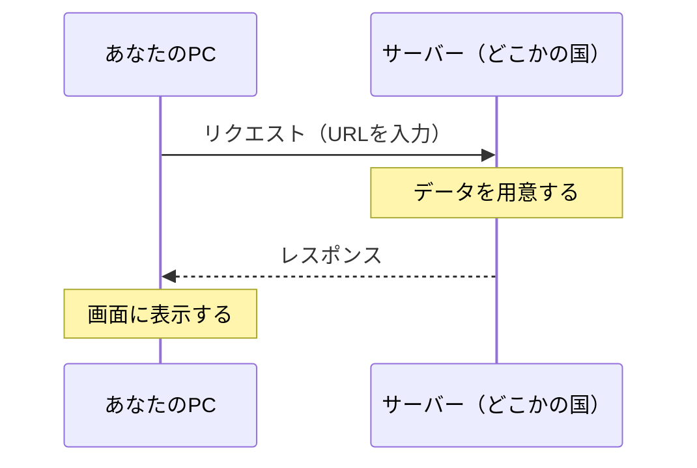

# 第1回：パソコンの仕組み（2026-05-09）

---

## 1. ビット・バイト・単位

パソコンはすべての情報を **0と1だけ** で表しています。  
文字も、写真も、動画も、すべては0と1の組み合わせです。

**0と1とは何か？**  
電気が「ある」か「ない」か、それだけです。  
電球のスイッチで言えば、ON（1）かOFF（0）か。  
これを入れる「箱」が1個 → **1ビット** と呼びます。

**箱が8個集まると？**  
8つの箱（8ビット）がひとまとまりになったものを **1バイト** と言います。  
「部屋に箱が8個並んでいて、それぞれにONかOFFが入っている」イメージです。

**単位はどんどん大きくなる：**

| 単位 | 大きさ | イメージ |
|------|--------|---------|
| 1 KB（キロバイト） | 約1,000バイト | 短いメール1通くらい |
| 1 MB（メガバイト） | 約1,000 KB | 写真1枚くらい |
| 1 GB（ギガバイト） | 約1,000 MB | 映画1本くらい |
| 1 TB（テラバイト） | 約1,000 GB | 映画1,000本くらい |

スマホの「128GB」とか「256GB」という数字は、  
この「どれだけ保存できるか」を表しています。

---

## 2. Cドライブとは？

パソコンの中には、データを保存しておく装置が入っています。  
これを **ストレージ（storage＝保管場所）** と呼びます。

Windowsではこのストレージを **「Cドライブ」** と名前で呼んでいます。  
エクスプローラーを開くと「C:」と表示されているあの場所です。

**なぜCなのか？**  
40〜50年前のパソコンには「フロッピーディスク」という薄い記録媒体が使われていました。  
それにA・Bという名前が割り当てられていたため、  
新しく登場したハードディスクに **C** が使われるようになりました。  
今はフロッピーがなくても、その名残でCのままです。

---

## 3. CPU・メモリ・ストレージ

パソコンの中で特に重要な3つの部品があります。

### CPU（シーピーユー）
**パソコンの「頭脳」です。**  
計算・処理をすべて担っています。  
「3.1GHz（ギガヘルツ）」という数字は、1秒間に **31億回** 処理できることを意味します。  
人間が1秒間に1回の計算しかできないとしたら、CPUは31億倍速いということです。

### メモリ
**「作業する机の上」です。**  
今やっていることを一時的に置いておく場所。  
アプリを開けば開くほど机の上が散らかっていくイメージです。  
パソコンを再起動すると「机の上が片付く」ので動作が軽くなることがあります。

### ストレージ（Cドライブ）
**「引き出しや棚」です。**  
机の上とは違い、電源を切っても消えない。  
写真・書類・アプリなど、長期間保存しておくものがここに入ります。

| 部品 | たとえ | 特徴 |
|------|--------|------|
| CPU | 頭脳 | 計算・処理する |
| メモリ | 机の上 | 今使うものを置く（電源を切ると消える） |
| ストレージ | 引き出し | ずっと保存しておける |

---

### なぜメモリはストレージより速いのか？

**距離と構造が違うからです。**

CPUはメモリと**直接つながっていて**、データのやり取りが一瞬で終わります。  
ストレージは**一度メモリを経由する**上、物理的に遠い場所にあるため時間がかかります。

速さのイメージ：

| 部品 | 速さのたとえ |
|------|------------|
| CPU（内部処理） | 新幹線 |
| メモリ | 高速道路 |
| SSD | 一般道路 |
| HDD | 自転車 |

だからパソコンは起動するとき、まずストレージからデータをメモリに読み込みます。  
「引き出しから机の上に出す」作業です。これが終わると操作が速くなります。  
**起動直後が重くて、しばらくすると軽くなる**のはこのためです。

---

## 4. なぜパソコンは古くなると重くなるのか？

パソコンを使い続けていると、だんだん動作が重くなります。  
これには大きく **3つの理由** があります。

### 理由①：部品が古くなる

パソコンの中のストレージ（データの保存場所）は、使うたびに少しずつ傷んでいきます。  
特にHDDという種類は機械的な部品が動いているので、年数が経つと読み書きが遅くなります。  
また、ストレージの空き容量が少ないと、さらに動作が重くなります。  
**理想は空き容量を半分以上残しておくこと。**

### 理由②：ゴミが溜まる

アプリを削除しても、完全には消えません。  
何年分もの「使わなくなったアプリのかけら」がパソコンの中に溜まっています。  
さらに、**画面には何も表示されていないのに裏でこっそり動いているアプリ** があります。  
これがメモリ（作業場）を占領して、パソコンを重くします。

> タスクマネージャー（キーボードの Ctrl + Shift + Esc）を開くと、今裏で何が動いているか見えます。

### 理由③：新しいソフトは新しいパソコン向けに作られる

スマホのアプリも、パソコンのソフトも、毎年どんどん機能が増えています。  
開発者は「最新のパソコンで動けばOK」という前提で作るので、  
古いパソコンにとっては**荷が重すぎる**状態になっていきます。

---

**チェックリスト：**
- 使用年数が長い → ストレージが劣化している可能性
- アプリを長年入れ続けている → ゴミが溜まっている可能性
- Windows 10のまま → すでにサポート終了。新しいソフトの前提から外れている

---

## 5. サーバーとは？

**「お願いを受け取って、何かを返す存在」** がサーバーです。

レストランで例えると：  
- あなた（お客さん）が「ラーメンください」と注文する  
- キッチン（サーバー）がラーメンを作って出す  

インターネットでも同じことが起きています。  
あなたがウェブサイトを開こうとすると、その裏でサーバーがデータを送り返しているのです。  
実はあなたのPCも、設定次第でサーバーになれます。

---

## 6. クラウドとデータセンター

「クラウド（cloud＝雲）」という言葉をよく聞きますが、  
雲の中に本当にデータが浮いているわけではありません。

クラウドの裏には、必ず **物理的なサーバー**（実際の機械）があります。  
それが何千台・何万台も並んでいる巨大な施設が **データセンター** です。

**データセンターはどこにある？**  
サーバーは動かし続けると熱を出します。冷やすのにお金がかかります。  
だから **寒くて・土地が安い場所** に建てられることが多いです。  
北欧（フィンランドやスウェーデン）や、アメリカの内陸部などが代表的です。

「Googleドライブ」「iCloud」「OneDrive」も、  
すべてどこかのデータセンターにあるサーバーに保存されています。

---

## 7. ウェブページが表示される仕組み

URLを入力してからページが表示されるまで、実は一瞬でこんなことが起きています。

この往復が、早ければ **0.1秒以下** で完了しています。

---

## 8. 設定画面が見つからないときは？

Windowsの設定は、メニューをたどって探すより **検索した方が早いです。**

**例：アップデートの画面を開きたい**  
画面左下の検索バーに「update」や「バージョン」と入れてみる → 候補が出てくるので、それをクリックするだけ。

完全な言葉を知らなくても、思いついた単語を入れれば大丈夫です。
